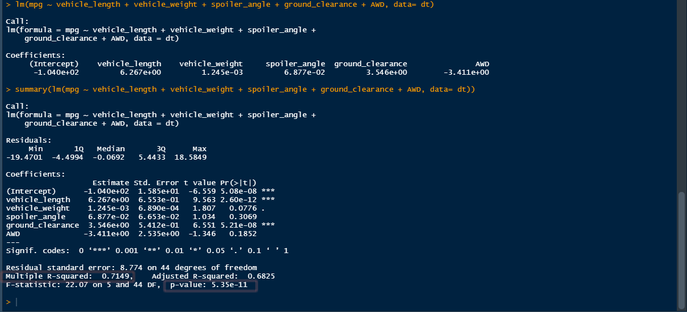

# MechaCar_Statistical_Analysis

## Linear Regression to Predict MPG

### Which variables/coefficients provided a non-random amount of variance to the mpg values in the dataset?

The two factors that are contributing to a non-random variance are the Vehicle Length and the Ground Clearance as they both have a p-value around 0.5. Vehicle lenght comes in at 
0.00000000000000022 which is nearly a zero and the ground clearance is at 0.0000000521. 

### Is the slope of the linear model considered to be zero? Why or why not?

The slope of the linear model is not at a zero as we have Multiple R-squared value at 0.7149 and the p-value is less than 0.05%. 

### Does this linear model predict mpg of MechaCar prototypes effectively? Why or why not?

Yes since our r-square value is about 71% and our p-value is less than 0.05% that tells us that that our predictions are correct.

## Summary Statistics on Suspension Coils

### The design specifications for the MechaCar suspension coils dictate that the variance of the suspension coils must not exceed 100 pounds per square inch. Does the current manufacturing data meet this design specification for all manufacturing lots in total and each lot individually? Why or why not?

As we look at total summary we can see that our Psi_Variance of 62.29 meets the current manafacturing specifications. 

When comparing the indivudual lots we see that lot 1 is at 0.979 and lot 2 is at 7.46Psi which means they are both below 100PSI and meet the design specification. One that stands out the most is lot 3 with 170.28 PSI which is way above the required specification.  

## T-Tests on Suspension Coils
When looking at the overall T-test for the suspensions coils we can see that our p-value is at 0.06028 which is above the 0.05% and its not much different than the population mean. 

Lot1 and Lot2 are above the 0.05% which means they are not statisticly different from the population mean of 1,500PSI.

When we are looking at our t-test on the suspension coils we can see that Lot3 data is reading p-value less than 0.05%. Lot 3 is statisticly different from the population mean of 1,500PSI. 

## Study Design: MechaCar vs Competition
